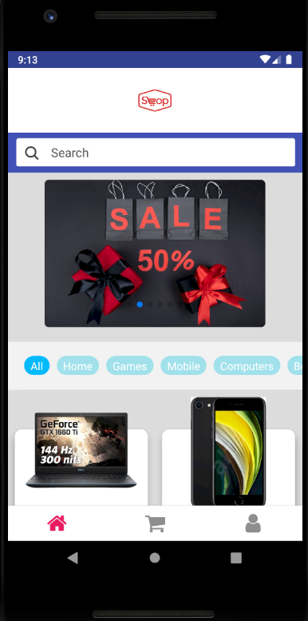
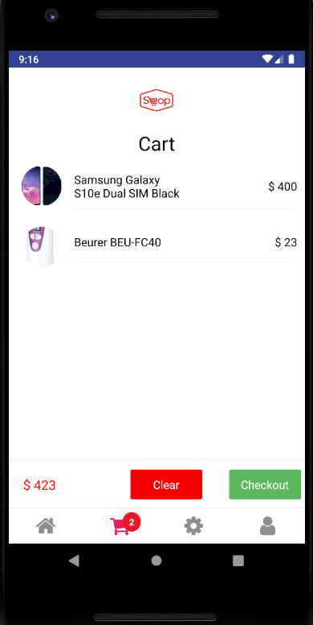
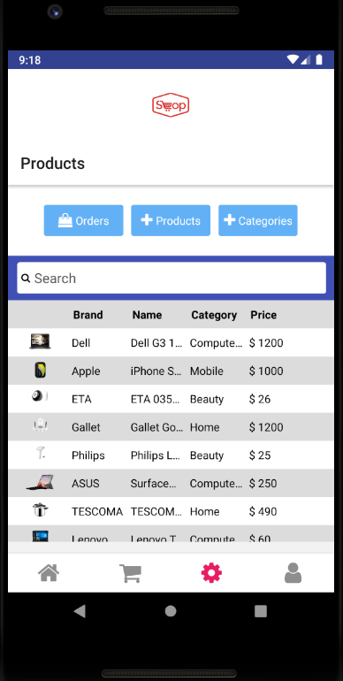

## ez-shop FrontEnd 

## Link to Android Download
https://russellbot.github.io/eshop-frontend/

## Sample
******

## Descriptions
******************
This is an ecommerce app for use as an online store. This mobile front end application was built with the React-Native framework in conjunction with some elements from Native-Base. This site works in tandem with a backend that I built using Node.js, Express, and MondgoDB.

Clients may browse items by category, use the search bar, add items to their cart, and checkout using their address and payment information. Users may view their profile information and order status on their profile tab.  User authentication was established so that users are able to create an account and login. Users with admin access may use the administrator tab where they can add or remove items in the store, make new categories, and manage orders made by other users. 

## Installation
*********
To contribute to this work simply fork and clone the repository and then run npm install. All packages will be installed upon that command. In order to have access to the backend that I created you can reach out so I can give you admin access.

## API's Used
- Deployed API that I built is https://ezshop-server.herokuapp.com/api/v1/. This is created in order to store user authentication information, products, categories, and orders.